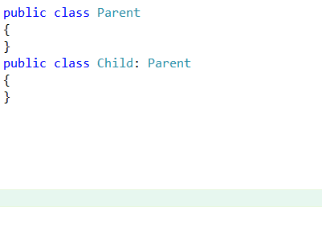

Insert New Parent Class
=======================

The existing 'Create Ancestor' CodeProvider that comes with CodeRush does not function if the Class in question already has a code ancestor.

This plugin is intended to fill that void.

### Usage ###

 * Place your caret (That blinky thing where text comes out in the editor) in a class declaration (on it's name is good)
 * Trigger the CodeRush?\Refactor SmartMenu.
 * Choose Insert New Parent Class
 * Name the generated class.
 * You're done :) 

An animated picture often works better than words ->

